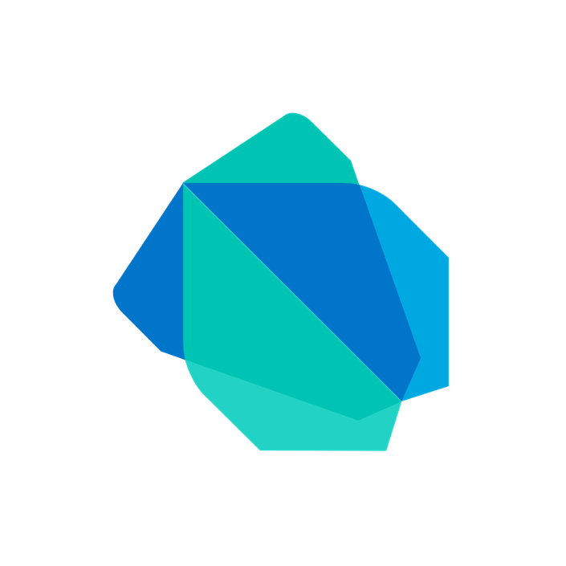

<br>
<div align="center">
    <div >
        
    </div>
    <div>
            <h3><b>Glutara</b></h3>
            <p><i>A Key to Your Diabetes Journey</i></p>
    </div>      
</div>
<br>
<h1 align="center">Glutara Mobile Application</h1>
Your pocket-sized companion: Glutara's mobile app is your intuitive dashboard, displaying real-time data, personalized insights, and a vibrant community right at your fingertips. It's your health cheerleader, empowering you to take control, one tap at a time.

## 👨🏻‍💻 &nbsp;Technology Stack

<div align="center">
<kbd>

</kbd>
<kbd>

</kbd>
<kbd>

</kbd>
<kbd>

</kbd>
</div>
<div align="center">
<h4>Flutter | Dart | Firebase | Google Maps Platform</h4>
</div>

## Getting Started
Make sure you already do these things before running the code
1. Install Flutter SDK on your computer

## ⚙️ &nbsp;How to Run
1. Clone this repository from terminal using this following command
   ```bash
   git clone https://github.com/Glutara/glutara-mobile.git
   ```
2. Install all the required dependencies using this following command in the project root directory
   ```bash
   flutter pub get
   ```
3. Run the mobile using this following command
   ```bash
   flutter run
   ```

## 📸 &nbsp;App Preview
<table width="100%">
  <tbody>
    <tr>
      <td width="1%"></td>
      <td width="1%"></td>
       <td width="1%"></td>
    </tr>
    <tr>
      <td width="1%"></td>
      <td width="1%"></td>
       <td width="1%"></td>
    </tr>
    <tr>
      <td width="1%"></td>
      <td width="1%"></td>
      <td width="1%"></td>
    </tr>
    <tr>
      <td width="1%"></td>
      <td width="1%"></td>
      <td width="1%"></td>
    </tr>
  </tbody>
</table>

## 👥 &nbsp;Contributors

| <a href="https://github.com/mikeleo03"></a> | <a href="https://github.com/GoDillonAudris512"></a> | <a href="https://github.com/margarethaolivia"></a> | <a href="https://github.com/AustinPardosi"></a> |
| ---------------------------------------------------------------------------------------------------------------------------------------------------------------------------------------------------------------------------------- | ----------------------------------------------------------------------------------------------------------------------------------------------------------------------------------------------------------------------------------- | -------------------------------------------------------------------------------------------------------------------------------------------------------------------------------------------------------------------------- | ----------------------------------------------------------------------------------------------------------------------------------------------------------------------------------------------------------------------------- |
| <div align="center"><h3><b><a href="https://github.com/mikeleo03">Michael Leon Putra Widhi</a></b></h3><i><p>Bandung Institute of Technology</i></p></div>                                                                               | <div align="center"><h3><b><a href="https://github.com/GoDillonAudris512">Go Dillon Audris</a></b></h3></a><p><i>Bandung Institute of Technology</i></p></div>                                                                          | <div align="center"><h3><b><a href="https://github.com/margarethaolivia">Margaretha Olivia Haryono</a></b></h3></a><p><i>Bandung Institute of Technology</i></p></div>                                                               | <div align="center"><h3><b><a href="https://github.com/AustinPardosi">Austin Gabriel Pardosi</a></b></h3></a><p><i>Bandung Institute of Technology</i></p></div>                                                                            |
